# OneHouse.

一生に 3 回も家を建てられますか？  
一度きりだから、OneHouse. でしっかり管理。

新築一戸建てを検討し始めた人が直面する、

- 情報の整理不足
- 専門知識の難しさ
- 複数メーカーや土地の比較検討の迷い  
  といった課題を解決し、安心して自分たちに合った家づくりを進められるようサポートするアプリです。


アプリ URL：https://onehouse.click/

解説記事(Qiita)：  
[要件定義と設計について](https://qiita.com/yuzu14s/items/b9ec7051357b575b0a2d)  
※コア機能については現在作成中！

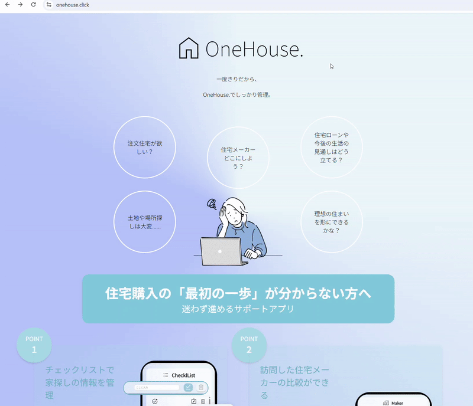

```
※テストユーザでログインも可能

メールアドレス Testlogin@co.jp
パスワード Password
```

## サービスを開発したきっかけ

私は住宅購入の過程で、ローン・土地探し・メーカー比較などに膨大な時間と労力を費やし、情報が分散していることに大きな不便さと不安を感じました。本来「家を建てる」という一つの目的なのに、銀行・保険会社・不動産・住宅メーカーと窓口が分かれているため、全体像を把握するのが難しく、納得のいく判断をするのが困難でした。  
だからこそ、同じ悩みを抱える人が安心して家づくりを進められるよう、
情報を整理し一元管理できる仕組みを提供したいと思い、アプリ開発をしました。

## 技術スタック

| カテゴリ       | 　使用技術           | バージョン | 説明                          |
| -------------- | -------------------- | ---------- | ----------------------------- |
| バックエンド   | Laravel              | v12        | ※認証は Laravel Breeze を使用 |
| フロントエンド | HTML/CSS・JavaScript |            |                               |
| フロントエンド | Vue.js               | v3.5.22    | ApexCharts を使用             |
| データベース   | MySQL                | v8.0.44    |                               |
| インフラ       | AWS（EC2）           |            | Amazon Linux                  |
| インフラ       | Apache               | v2.4.65    |                               |
| バージョン管理 | Git/GitHub           |            | GitHub Actions(CI/CD)         |


## サービス機能一覧(アプリ画面)

### チェックリスト画面

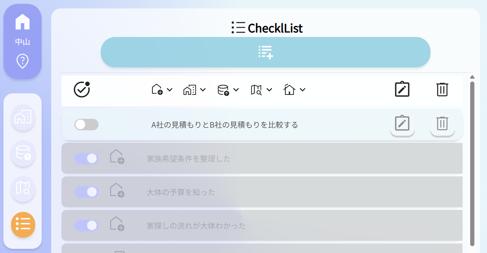

- ユーザー登録と同時に、初期データが作成
- タスクを登録・編集・削除・完了

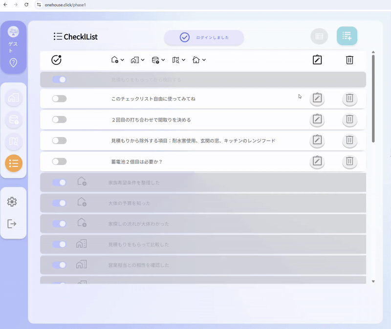

### メーカー訪問記録画面

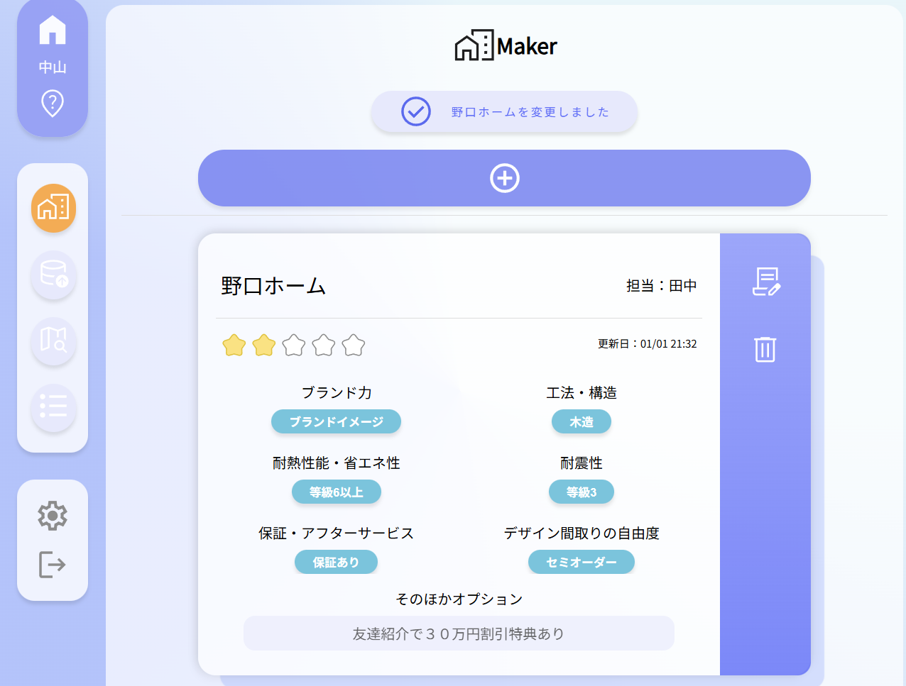

- 住宅展示場や工務店訪問の見積もり・メモのログ記録
- 訪問記録を変更・削除

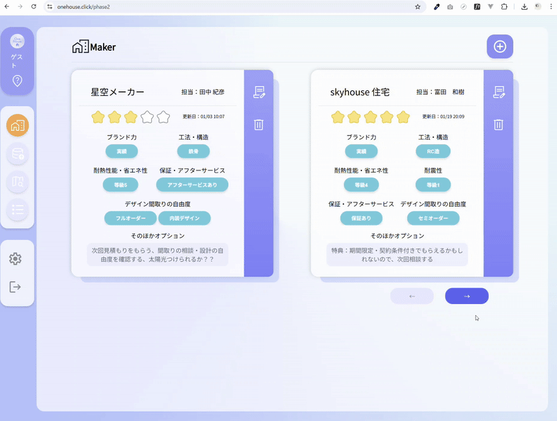

### 住宅ローンシュミレーション画面

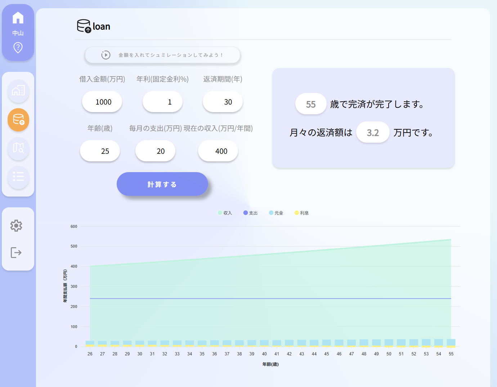

- 住宅ローン・諸費用の目安・バランスをチャート化
- 住宅ローン完済年齢・月々の返済額が表示

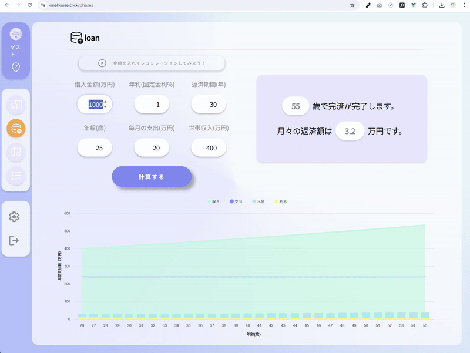

### 建築可能面積シュミレーション画面

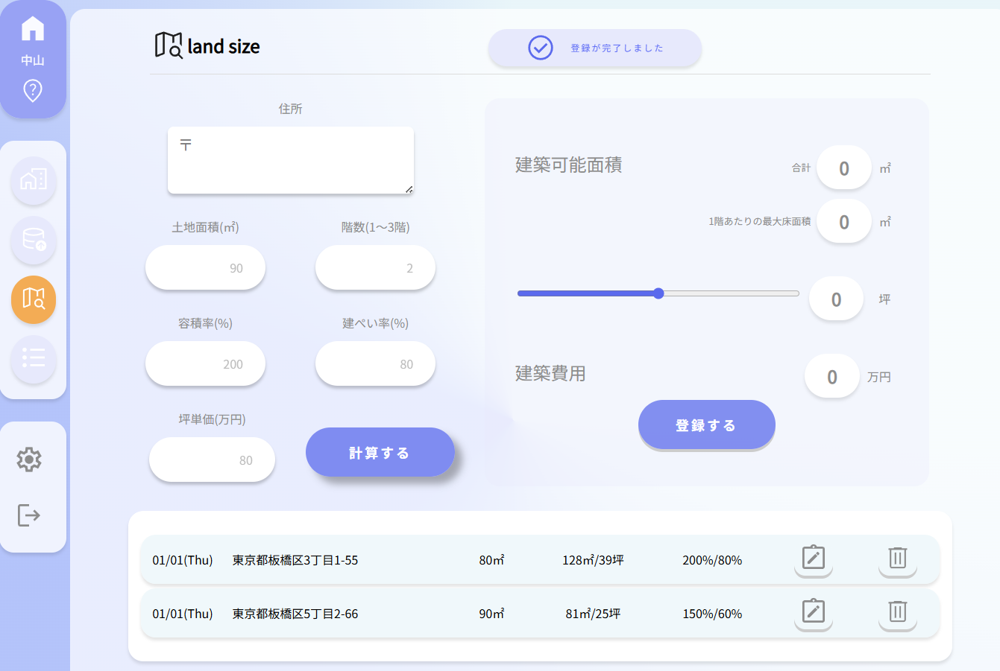

- 建築可能面積の計算バー  
  （建ぺい率と容積率・階数、坪単価を入れると建物面積と金額を教えてくれる）
- 保存先の編集・削除

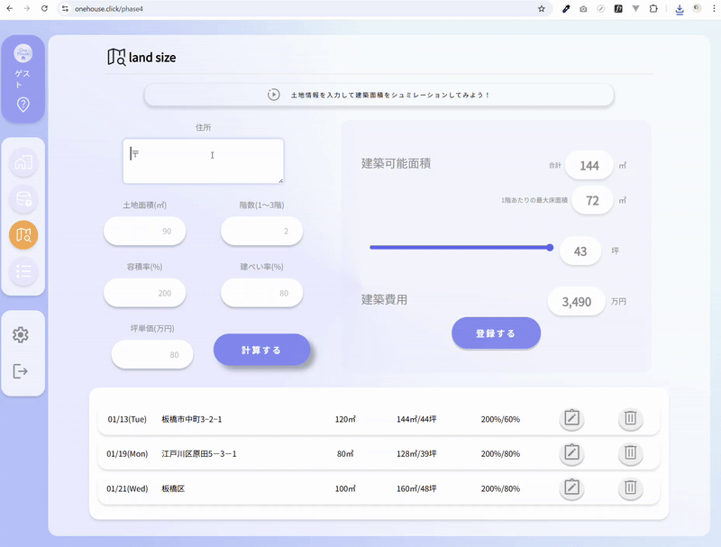

### 認証

- ユーザー登録機能
- ログイン・ログアウト機能
- パスワード変更機能

## ER 図

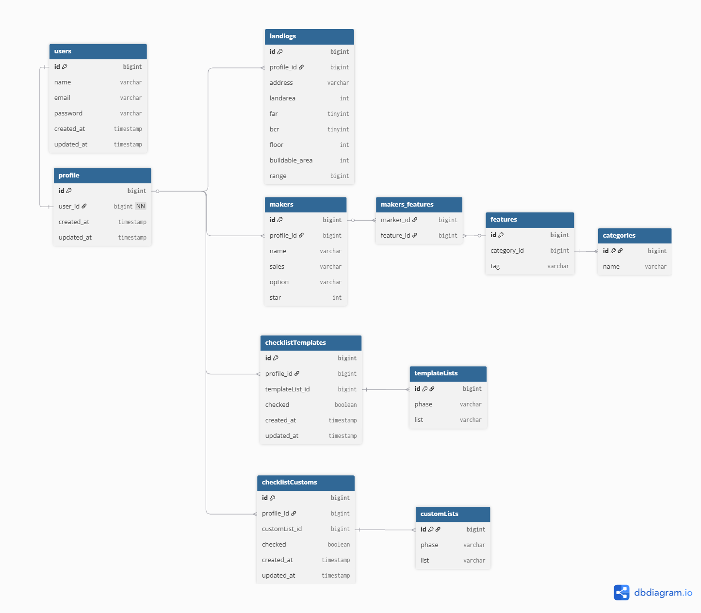

## インフラ構成図

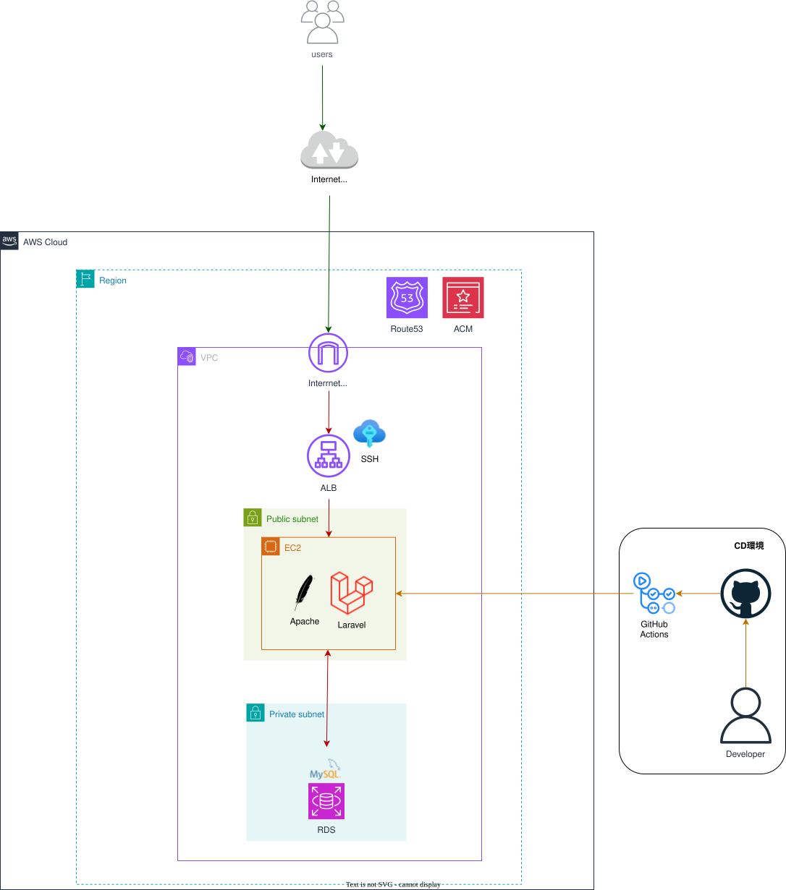

## テーブル定義

[テーブル定義はこちら](docs/database_schema.md)

## 業務フロー図

[業務フロー図はこちら](docs/business_flow.md)

## 画面遷移図・ワイヤーフレーム

[画面遷移図・ワイヤーフレームはこちら](docs/screen_transition.md)

## 工夫やこだわった点
- ログイン後、全機能を一覧できるダッシュボード UI を設計した点
- ユーザーが触りたくなるボタン演出を実装した点
- 間取りアプリや住宅ローン単体のアプリとは違って、一戸建て検討時～住宅完成までの家づくりを**段階で理解・管理**できる点
- GitHub Actions を使って、main ブランチにマージされると EC2 に SSH 接続して自動でデプロイされる点

- 計算ロジックと UI 操作を分割した点
- ユーザーが次の操作に迷わないエラーメッセージを追加した点
